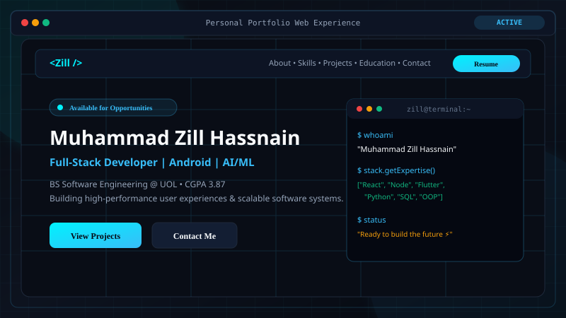

# Muhammad Zill Hassnain – Professional Portfolio Website



> **Live Portfolio & Personal Brand** for **Muhammad Zill Hassnain**  
> *Software Engineering Student • Full-Stack Web Developer • Android Developer • AI & Machine Learning Enthusiast*

---

## 🌟 Overview

This repository contains the complete source code for the personal portfolio website of **Muhammad Zill Hassnain**. 

Designed with a high-end dark cyber-tech aesthetic, electric cyan/blue lighting accents, and glassmorphism card surfaces, this portfolio is built with **Pure Semantic HTML5, Modern CSS3, and Vanilla JavaScript (ES6+)** with **zero runtime framework dependencies** for optimal speed, SEO discoverability, and accessibility.

---

## 👤 Profile & Verified Credentials

- **Full Name**: Muhammad Zill Hassnain
- **Current Degree**: Bachelor of Science in Software Engineering (BSSE)
- **Institution**: University of Lahore (Sargodha Campus)
- **Semester**: 7th Semester
- **Cumulative GPA**: **3.87 / 4.00** (Across 6 completed semesters)
- **Academic Standing**: Academic Position Holder & Class Topper (Grade: A+)
- **Secondary / FSc**: 
  - FSc Pre-Engineering: Superior College, Sillanwali (85.72%)
  - Matriculation: Comprehensive Model High School, Sillanwali (91.55%)
- **Leadership & Societies**:
  - Class Representative (CR) – Department of Software Engineering
  - Event Management Society – Active Society Member
  - University Cricket Team – Varsity Athlete
  - University Speed Programming Competitions – Algorithmic Competitor
- **Contact & Channels**:
  - **Phone / WhatsApp**: `+92 340 6915473`
  - **Email**: `zillhassnain005@gmail.com`
  - **Location**: Sillanwali / Sargodha, Punjab, Pakistan
  - **GitHub**: [github.com/MuhammadZillHassnain-bit](https://github.com/MuhammadZillHassnain-bit)
  - **LinkedIn**: [linkedin.com/in/muhammad-zill-hassnain-9442bb259](https://www.linkedin.com/in/muhammad-zill-hassnain-9442bb259)

---

## 🚀 Key Features

1. **Dark Cyber Aesthetic**: Deep obsidian backgrounds (`#070a10`), cybernetic grid overlays, and radial glowing light orbs.
2. **Typewriter Headline Engine**: Dynamically cycles through professional identities (*Full-Stack Developer*, *Android App Developer*, *AI & Machine Learning Enthusiast*, *Software Engineering Student*).
3. **Verified Genuine Profile Portrait**: Features Muhammad Zill Hassnain's authentic photograph with rotating orbital halo rings and floating micro-badges.
4. **Honest Technical Skill System**: Skills categorized clearly into *Experienced*, *Practicing*, and *Learning* without misleading percentage bars.
5. **Interactive Project Showcase**:
   - Filter projects by category (*Web Development*, *Software Engineering*, *AI & Machine Learning*).
   - Deep-dive interactive modal window with system architecture details and feature breakdowns.
6. **Academic Credentials Timeline**: Interactive timeline highlighting BSSE at UOL, FSc Engineering, and Matriculation achievements.
7. **Interactive Contact Engine**:
   - Validated form (Name, Email format, Subject, Message) with instant visual feedback and toast alerts.
   - Direct WhatsApp click-to-chat integration (`wa.me/923406915473`).
8. **Real Downloadable Resume**: Linked directly to `assets/resume/Muhammad_Zill_Hassnain_Resume.pdf`.
9. **Back to Top Progress Ring**: Dynamic circular SVG indicator that updates in real-time as the user scrolls down the page.
10. **Accessibility & SEO**: Semantic HTML5 landmark structure, ARIA controls, WCAG high-contrast compliance, OpenGraph social sharing meta, and JSON-LD structured schema.

---

## 📁 Repository Structure

```
d:\Personal Portfolio\
├── index.html                           # Main HTML5 entry point with all 10 sections & SEO
├── style.css                            # Modern CSS3 design system with CSS custom properties
├── script.js                            # Vanilla JavaScript engine & centralized data config
├── README.md                            # Complete setup & deployment guide
├── assets/
│   ├── icons/
│   │   ├── favicon.svg                  # High-res SVG favicon with glow effects
│   │   └── logo.svg                     # Brand monogram logo
│   ├── images/
│   │   ├── zill_profile.jpg             # Authentic portrait of Muhammad Zill Hassnain
│   │   ├── project-pdf-generator.svg    # I Love PDF Web Application mockup
│   │   ├── project-library-system.svg   # Library Management System mockup
│   │   ├── project-quiz-app.svg         # Quiz App interactive UI mockup
│   │   ├── project-university-system.svg# University ERP management mockup
│   │   ├── project-student-system.svg   # Student Attendance & Records mockup
│   │   ├── project-portfolio-website.svg# Personal Portfolio preview
│   │   ├── project-iris-classifier.svg  # Iris ML botanical classifier mockup
│   │   └── project-student-analytics.svg# Student performance data analysis mockup
│   └── resume/
│       └── Muhammad_Zill_Hassnain_Resume.pdf # Genuine PDF resume
└── portfolio/                           # Standalone copy ready for nested distribution
    ├── index.html
    ├── style.css
    ├── script.js
    └── assets/ ...
```

---

## 💻 Local Development Setup

No build step or complex package compilation is required!

### Option 1: Using Node.js (Recommended)
You can use `npx serve` or any static HTTP server:
```powershell
# Navigate to the portfolio directory
cd "d:\Personal Portfolio"

# Start a local static server
npx serve -p 3000
```
Open `http://localhost:3000` in any browser.

### Option 2: Using Python
```powershell
python -m http.server 8000
```
Open `http://localhost:8000` in any browser.

### Option 3: VS Code Live Server
Right-click on `index.html` in VS Code or Antigravity IDE and choose **"Open with Live Server"**.

---

## ⚙️ Customization Guide

### 1. Updating Personal Information & Links
All dynamic texts and project records are centralized in `script.js` under the `portfolioConfig` object:
```javascript
const portfolioConfig = {
  owner: {
    fullName: "Muhammad Zill Hassnain",
    email: "your-email@example.com",
    phone: "+92 340 6915473",
    whatsappUrl: "https://wa.me/923406915473",
    githubUrl: "https://github.com/your-username",
    linkedinUrl: "https://linkedin.com/in/your-username",
    resumePath: "assets/resume/Muhammad_Zill_Hassnain_Resume.pdf"
  },
  ...
};
```
Also update the corresponding labels or contact links in `index.html`.

### 2. Replacing the Resume PDF
To update your resume with a newer edition:
1. Save your new PDF file with the name `Muhammad_Zill_Hassnain_Resume.pdf`.
2. Replace the file located at:
   `assets/resume/Muhammad_Zill_Hassnain_Resume.pdf`
3. The "Download Resume" buttons on the navigation bar, hero section, and footer will automatically download the new file.

### 3. Adding or Updating Projects
In `script.js`, edit or add keys inside `portfolioConfig.projects`:
```javascript
"new-project-id": {
  title: "New Project Title",
  category: "Web Development",
  categoryTag: "React • Express",
  status: "Completed",
  statusType: "completed",
  image: "assets/images/new-project-preview.svg",
  shortDesc: "Short summary...",
  fullDesc: "Complete description for modal dialog...",
  architecture: "Technical architecture...",
  features: ["Feature 1", "Feature 2"],
  techStack: ["React", "Node.js"],
  githubUrl: "https://github.com/...",
  demoUrl: "https://..."
}
```
Add the card markup in `index.html` within `<div class="projects-grid">` referencing `data-modal="new-project-id"`.

### 4. Connecting a Backend Email Service
By default, submitting the contact form opens the user's default email client with a pre-filled `mailto:` link. To connect a direct API email backend like **Formspree** or **EmailJS**:
- **Formspree**: Add `action="https://formspree.io/f/YOUR_FORM_ID"` and `method="POST"` to `<form id="portfolio-contact-form">` in `index.html`.
- **EmailJS**: Initialize EmailJS SDK in `script.js` and call `emailjs.sendForm(...)` inside `initContactForm()`.

---

## 🌐 Deployment Instructions

### 1. Netlify (Recommended)
1. Push your repository to GitHub.
2. Log in to [Netlify](https://www.netlify.com/).
3. Click **"Add new site"** → **"Import an existing project"** → Select your GitHub repo.
4. Set:
   - **Publish directory**: `.` (or `portfolio`)
   - **Build command**: *(leave blank)*
5. Click **Deploy**. Your portfolio will be live in seconds!

### 2. GitHub Pages
1. Go to your GitHub repository **Settings** → **Pages**.
2. Under **Build and deployment** → **Source**, select `Deploy from a branch`.
3. Choose branch `main` and folder `/ (root)`.
4. Click **Save**. Your site will be published at `https://<your-username>.github.io/<repo-name>/`.

### 3. Vercel
1. Log in to [Vercel](https://vercel.com/).
2. Click **"Add New Project"** → Import your repository.
3. Keep default settings (Framework Preset: Other).
4. Click **Deploy**.

---

## 🛡️ License & Credits

- Engineered for **Muhammad Zill Hassnain**.
- Built with HTML5, CSS3, and JavaScript.
- Icons by [Font Awesome](https://fontawesome.com/).
- Typography: [Google Fonts](https://fonts.google.com/) (Plus Jakarta Sans, Inter, JetBrains Mono).
